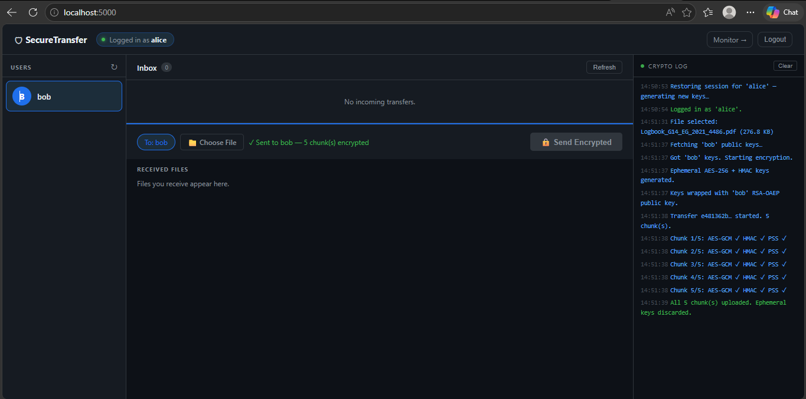
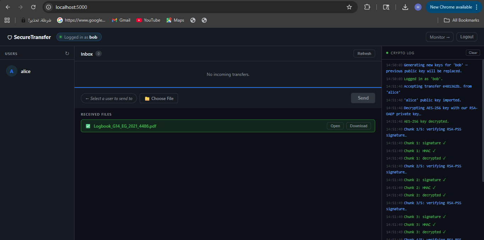
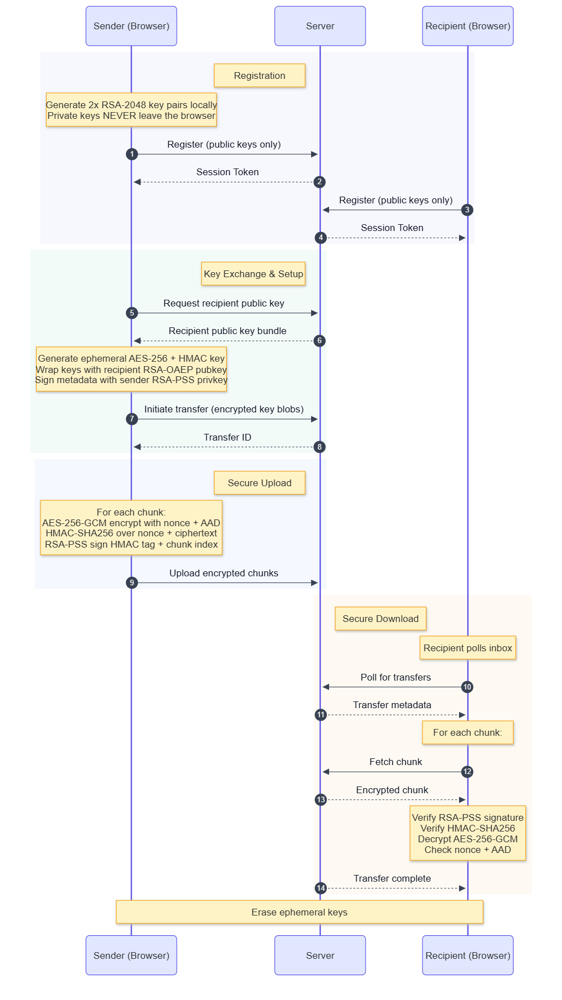

# 🔐 Secure File Sharing Protocol

A browser-native, end-to-end encrypted file transfer system. Private keys **never leave the client browser** — the server is a blind relay that stores only public keys and encrypted ciphertext.

> Built with Python (Flask) + Web Crypto API. Zero external crypto dependencies on the client.

---

## 📸 Screenshots

### Sender View — Alice sending an encrypted file to Bob


### Receiver View — Bob decrypting chunks in-browser


---

## ✨ Key Security Properties

| Property | Mechanism |
|---|---|
| **Confidentiality** | AES-256-GCM per-chunk encryption |
| **Integrity** | HMAC-SHA256 + AES-GCM authentication tag |
| **Authentication** | RSA-PSS-2048 per-chunk digital signatures |
| **Key Secrecy** | Private keys generated in-browser, never transmitted |
| **Replay Protection** | Per-chunk nonce + transfer ID bound via AAD |
| **Forward Secrecy** | Ephemeral AES/HMAC keys discarded after transfer |
| **MitM Protection** | Sender signs all metadata + each chunk independently |

---

## 🏗️ Workflow Architecture

The full cryptographic handshake follows a 14-step protocol across three parties: **Sender Browser → Server → Recipient Browser**.



### Phase 1 — Registration

```
Browser                              Server
  │  Generate RSA-2048 OAEP keypair    │
  │  Generate RSA-2048 PSS  keypair    │
  │  (private keys stay in-tab)        │
  │──── POST /api/register ───────────▶│
  │     { username, public_key_bundle }│
  │◀─── { session_token } ────────────│
```

- Two RSA-2048 key pairs are generated entirely inside the browser via `window.crypto.subtle`
- Only the **public** keys are sent to the server as a JSON bundle: `{ oaep: "...", pss: "..." }`
- The server stores the public key bundle and issues a session token (hex-32)

### Phase 2 — Key Exchange & Transfer Initiation

```
Sender Browser                       Server
  │  Fetch recipient's public keys     │
  │──── GET /api/get_public_key ──────▶│
  │◀─── { oaep_pub, pss_pub } ────────│
  │                                    │
  │  Generate ephemeral AES-256 key    │
  │  Generate ephemeral HMAC-256 key   │
  │  Wrap both with recipient RSA-OAEP │
  │  Sign metadata with sender RSA-PSS │
  │──── POST /api/initiate_transfer ──▶│
  │     { enc_aes_key, enc_hmac_key,   │
  │       meta_signature, filename }   │
  │◀─── { transfer_id } ──────────────│
```

- Ephemeral symmetric keys are wrapped (encrypted) with the **recipient's** RSA-OAEP public key
- The server never sees plaintext symmetric keys
- File metadata is signed by the sender's RSA-PSS private key to prevent tampering

### Phase 3 — Chunked Encrypted Upload

```
For each chunk (default 512 KB):
  ┌─────────────────────────────────────────────────────┐
  │ 1. Generate random 96-bit nonce (IV)                 │
  │ 2. AES-256-GCM encrypt chunk                         │
  │    additionalData = "chunk:{idx}:transfer:{tid}"     │
  │ 3. HMAC-SHA256(nonce ‖ ciphertext)                   │
  │ 4. RSA-PSS sign (HMAC_tag ‖ chunk_index)            │
  │ 5. Upload: { ciphertext, nonce, hmac, signature }    │
  └─────────────────────────────────────────────────────┘
```

### Phase 4 — Secure Download & Decryption

```
Recipient Browser                    Server
  │──── GET /api/inbox ──────────────▶│
  │◀─── [ transfer metadata ] ────────│
  │                                    │
  │  Decrypt AES key: RSA-OAEP(priv)  │
  │  Decrypt HMAC key: RSA-OAEP(priv) │
  │                                    │
  │  For each chunk:                   │
  │──── GET /api/get_chunk ───────────▶│
  │◀─── { ciphertext, nonce,hmac,sig } │
  │  Verify RSA-PSS signature ✓        │
  │  Verify HMAC-SHA256 ✓              │
  │  Decrypt AES-256-GCM ✓             │
  │  Check nonce + AAD binding ✓       │
  │                                    │
  │  Reassemble file in-memory         │
  │  Offer browser download            │
  │  Discard ephemeral keys            │
```

---

## 📁 Project Structure

```
Secure-File-sharing-Protocol/
│
├── server.py              # Flask REST API — blind relay server
├── database.py            # SQLite ORM — users, transfers, chunks, logs
├── start.py               # Entry point launcher
├── requirements.txt       # Python dependencies
│
├── templates/
│   ├── client.html        # Full SPA — all crypto runs here (Web Crypto API)
│   └── monitor.html       # Real-time transfer monitor dashboard
│
├── data/
│   └── secure_transfer.db # SQLite database (auto-created on first run)
│
├── logs/
│   └── server.log         # JSONL structured event log
│
├── images/
│   └── secure_file_transfer.png   # Protocol sequence diagram
│
└── received/              # Placeholder directory (files stay in-browser)
```

### Key File Roles

**`server.py`** — 13 REST endpoints. Acts as a blind relay:
- `/api/register` and `/api/login` — manage public keys + session tokens
- `/api/initiate_transfer` — stores encrypted key blobs, issues transfer ID
- `/api/upload_chunk` — stores ciphertext, nonce, HMAC, signature
- `/api/get_chunk` — serves encrypted chunks to authenticated recipient only
- `/api/inbox` — lists pending transfers for a user
- `/api/logs` and `/api/status` — monitoring endpoints

**`database.py`** — Four SQLite tables:
- `users` — username, public_key_pem bundle, session_token, timestamps
- `transfers` — transfer metadata, encrypted key blobs, status lifecycle
- `chunks` — per-chunk encrypted data, nonce, HMAC, signature
- `logs` — structured audit trail (timestamp, level, event, actor, message)

**`templates/client.html`** — Single-page app with all crypto:
- Key generation: `crypto.subtle.generateKey()` for RSA-OAEP + RSA-PSS
- Encryption: `AES-GCM` + `RSA-OAEP` key wrapping
- Integrity: `HMAC-SHA256`
- Signing: `RSA-PSS` per chunk
- Everything runs in the browser — zero crypto libraries downloaded

---

## 🛡️ Security Threat Model

### Threats Addressed

#### 1. Man-in-the-Middle (MitM) Attack
**Threat:** An attacker intercepts traffic between browser and server and injects or replaces file data.

**Mitigation:**
- Every chunk is signed with the sender's **RSA-PSS-2048 private key** (which never leaves their browser)
- The recipient verifies each signature against the sender's registered public key before decryption
- Even if the server is compromised, injected chunks will fail signature verification

#### 2. Replay Attack
**Threat:** An attacker captures a valid encrypted chunk and replays it in a different transfer or at a different position.

**Mitigation:**
- Each chunk is encrypted with `AES-256-GCM` using `additionalData = "chunk:{idx}:transfer:{tid}"`
- The nonce, chunk index, and transfer ID are **cryptographically bound** into the AAD
- Replaying a chunk from another transfer or another position causes GCM authentication failure

#### 3. Server Compromise / Insider Threat
**Threat:** The server operator reads stored file content.

**Mitigation:**
- The server stores **only ciphertext** — it never receives plaintext file data
- AES/HMAC keys are wrapped with the recipient's RSA-OAEP public key, so the server cannot unwrap them
- Private keys are never transmitted; only public keys are stored server-side

#### 4. Eavesdropping / Passive Interception
**Threat:** Network-level sniffing of the HTTP traffic.

**Mitigation:**
- All file content is AES-256-GCM encrypted client-side before upload
- The server only ever receives and serves opaque encrypted blobs
- Combined with HTTPS in production, no plaintext is transmitted at any layer

#### 5. Chunk Tampering / Bit-Flip Attack
**Threat:** An attacker modifies encrypted chunks in transit or in storage.

**Mitigation (layered):**
- **AES-GCM authentication tag**: any byte-level modification of ciphertext is detected and decryption throws
- **HMAC-SHA256** over `nonce ‖ ciphertext`: second independent integrity check
- **RSA-PSS signature** over `HMAC_tag ‖ chunk_index`: third layer, also proves sender authenticity

#### 6. Key Theft / Private Key Exposure
**Threat:** Private keys are exfiltrated from the client.

**Mitigation:**
- Keys only exist in-memory within the browser tab's `CryptoKey` objects
- On page refresh, keys are gone — new keys are generated on next login (Perfect Forward Secrecy on re-login)
- `COOP/COEP` headers (`Cross-Origin-Opener-Policy: same-origin`, `Cross-Origin-Embedder-Policy: require-corp`) mitigate Spectre-style cross-origin memory reads

#### 7. Session Hijacking
**Threat:** An attacker steals a session token and impersonates a user.

**Mitigation:**
- Session tokens are 32-byte random hex (`secrets.token_hex(32)`) — 256-bit entropy
- Tokens are invalidated on logout via `database.invalidate_session()`
- Even with a stolen token, the attacker cannot decrypt received files without the victim's private key

#### 8. Stale Transfer Attack (Re-login Key Rotation)
**Threat:** User re-logs in with new keys; old transfers encrypted with previous key could be decrypted by someone who obtained the old private key.

**Mitigation:**
- On re-login, `mark_stale_transfers()` immediately sets all pending transfers to `status='stale'`
- Stale transfers are excluded from the inbox — they can never be downloaded
- This is the system's **Perfect Forward Secrecy** mechanism for re-login

### Threat Summary Table

| Threat | Layer | Mechanism |
|---|---|---|
| MitM / data injection | Per-chunk | RSA-PSS-2048 signature |
| Replay attack | Per-chunk | AES-GCM AAD binding (chunk index + transfer ID) |
| Server reads files | Architecture | Server only stores ciphertext, never keys |
| Eavesdropping | Transport | AES-256-GCM before upload |
| Chunk tampering | Per-chunk | GCM auth tag + HMAC-SHA256 (double integrity) |
| Private key theft | Browser | In-memory CryptoKey, COOP/COEP headers |
| Session hijacking | Auth | 256-bit random token, invalidated on logout |
| Old key compromise | Re-login | Stale transfer purge on key rotation |

---

## 🚀 Local Setup

### Prerequisites

- Python 3.9+
- pip

### 1. Clone project

```bash
git clone <repo-url>
cd Secure-File-sharing-Protocol
```

### Install dependencies

```bash
pip install -r requirements.txt
```

### Running the Server

```bash
python start.py
```

The launcher prints:
```
╔══════════════════════════════════════════════╗
║        Secure File Transfer — Ready          ║
╠══════════════════════════════════════════════╣
║  Open:    http://localhost:5000              ║
║  Monitor: http://localhost:5000/monitor      ║
╚══════════════════════════════════════════════╝
```

Open **two browser tabs** (or two different browsers) to simulate Alice ↔ Bob:

| Tab | URL | Action |
|---|---|---|
| Tab 1 | `http://localhost:5000` | Register as `alice` |
| Tab 2 | `http://localhost:5000` | Register as `bob` |
| Tab 1 | — | Select `bob`, choose file, click **Send Encrypted** |
| Tab 2 | — | Click **Refresh** inbox, click **Accept & Decrypt** |

### Monitor Dashboard

Visit `http://localhost:5000/monitor` to see a live view of:
- Registered users and last-seen timestamps
- Transfer status (pending → ready → completed / stale)
- Real-time crypto event log

### File & Directory Notes

| Path | Auto-created? | Notes |
|---|---|---|
| `data/secure_transfer.db` | ✅ Yes | SQLite DB, created on first run |
| `logs/server.log` | ✅ Yes | JSONL structured log |
| `received/` | ✅ (empty) | Placeholder — files are saved in-browser, not on disk |


### Production Deployment

For production use, deploy behind HTTPS (e.g. nginx + Let's Encrypt). Change `app.run(host="127.0.0.1")` to `host="0.0.0.0"` in `server.py` and set a stable `app.secret_key` via environment variable rather than re-generating on every start:

```python
app.secret_key = os.environ.get("SECRET_KEY", secrets.token_hex(32))
```

---

## 🔑 Cryptographic Primitives Reference

| Primitive | Algorithm | Purpose |
|---|---|---|
| Asymmetric encryption | RSA-OAEP-2048 / SHA-256 | Wrap ephemeral AES + HMAC keys |
| Digital signature | RSA-PSS-2048 / SHA-256 | Sign metadata + every chunk |
| Symmetric encryption | AES-256-GCM | Encrypt file chunks |
| MAC | HMAC-SHA256 | Secondary integrity over nonce + ciphertext |
| Nonce | 96-bit random (per chunk) | GCM IV; also bound in AAD |
| Session token | 32-byte random hex | 256-bit session identifier |

All browser-side crypto uses the [Web Crypto API](https://developer.mozilla.org/en-US/docs/Web/API/Web_Crypto_API) (`window.crypto.subtle`) — no third-party crypto library is loaded.

---

## 📡 API Reference

| Method | Endpoint | Auth | Description |
|---|---|---|---|
| POST | `/api/register` | — | Register new user, upload public key bundle |
| POST | `/api/login` | — | Re-login, rotate keys, purge stale transfers |
| POST | `/api/logout` | ✅ | Invalidate session token |
| GET | `/api/check_username` | — | Check if username exists |
| GET | `/api/users` | ✅ | List other registered users |
| GET | `/api/get_public_key/:user` | ✅ | Fetch a user's public key bundle |
| POST | `/api/initiate_transfer` | ✅ | Start a transfer, store encrypted key blobs |
| POST | `/api/upload_chunk` | ✅ | Upload one encrypted chunk |
| GET | `/api/inbox` | ✅ | List ready transfers for authenticated user |
| GET | `/api/get_chunk` | ✅ | Download one encrypted chunk |
| POST | `/api/complete_transfer` | ✅ | Mark transfer completed |
| GET | `/api/logs` | — | Retrieve recent audit log entries |
| GET | `/api/status` | — | Server statistics |

**Auth headers** (for ✅ endpoints):
```
X-Username: alice
X-Session-Token: <64-char hex token>
```

---